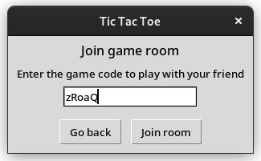

# Tic Tac Toe with a twist

Tic Tac Toe server written in Twisted Python.

## What makes this different?
- Host a game room
- Share your game code with your friend to let them join the game.

## Screenshots
Main Menu

Hosting a game room

Joining a game room with game code

Game board

## Gameplay demo

[demo.webm](https://user-images.githubusercontent.com/16078204/217515833-5d87e762-d35f-4ce7-a5e4-a46a6cde1124.webm)

## How to run
- Clone the repo
- CD into the server directory
- Install the requirements
- Run `ttt_server.py` 
